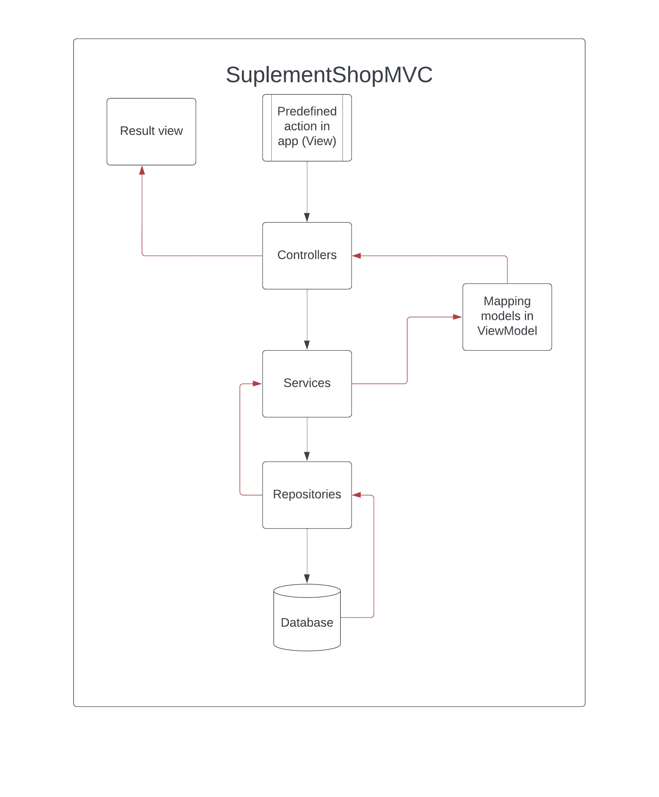

# SuplementShopWEB.MVC

## IMPORTANT
At the beginning 
Point of project is learning ASP.NET MVC making improve etc. 

## Idea:
Managment system for employees of Suplement shop.

## Roles:
Already in: 
- Admin Role(Top Level Permision): 
Adding admin permision, deleting users, creating new orders and actions realated,
creating items and actions realated, adding new customer and actions realated
*Action realated full CRUD

- Authorize User (base role for employee):
Creating items, adding new customer and all orders and actions realated
*Action realated full CRUD

- Unauthorize User:
Can browse the list of items with details, can browse the customer list. 

## Tech:
Already in: 
- .NET 7.0 
- ASP.NET MVC Concept 
- EntityFramworkCore
- SQL 
- Dependency Injection
- Clean Architecture
- GIT
- AutoMapper
- Fluent Validation
- Authentication by Individual account
- Authentication by Google Account (google API)
- Roles for users
- JWT
- PDF Generator for new orders

## How Application look already
Making Order
(Authorize and Admin only)

Authorize app look

Add new Item 

Unauthorize app look

## Data transfer schema

